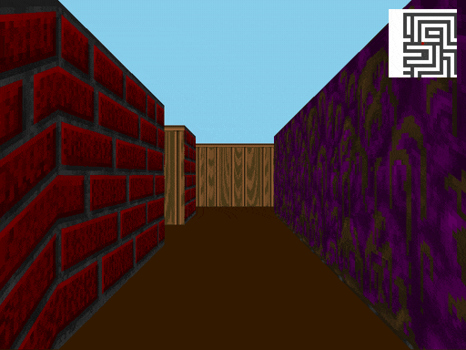
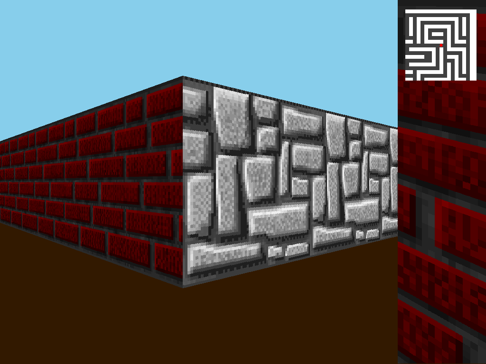

_This project has been created as part of the 42 curriculum by mteichma, bergun._

# cub3D

A first-person maze renderer in C that turns a `.cub` scene file into a textured 3D view by casting one ray per screen column through a 2D grid, drawn with MiniLibX.



## What it does

- Parses and validates a `.cub` scene: four wall textures (`NO`, `SO`, `WE`, `EA`, XPM files that must exist), floor and ceiling colours (`F`, `C` as `R,G,B`, each 0-255), then a map of `1` (wall), `0` (floor) and exactly one spawn letter `N`, `S`, `E` or `W`. Elements may come in any order; the map must come last. Any error prints `Error` and a specific reason (`Duplicate texture`, `Color out of range`, `Empty line in map`, `Map not closed`, `Multiple player`, ...) and exits with status 1.
- Renders a 1024x768 view with a horizontal field of view of about 67 degrees (camera plane length 0.66): one texture per wall orientation, flat floor and ceiling colours, and a darker shade on walls hit on a y-side.
- Controls: `W`/`S` move forward and back, `A`/`D` strafe, left and right arrows rotate, `Esc` or the window's close button quits.
- Bonus features, compiled into the main binary (there is no separate `bonus` rule): wall collision with sliding, a player-centred minimap in the top-right corner, and horizontal mouse look.

`assets/maps/ok` holds six valid maps. `assets/maps/error` holds 24 malformed scenes used as a manual test corpus: 23 are rejected; `error_map_too_small.cub`, a closed 3x3 room, is accepted, which the subject allows.

## Screenshots

| Spawn corridor | A corner, minimap top right |
| --- | --- |
|  |  |

Captured from the current code on Debian under Xvfb, with `assets/maps/ok/maze_adventure.cub`. The 3D view is the left-right mirror of the map and of the minimap (see Limitations).

## How it works

```
.cub ──> parser (t_config) ──> bridge_to_scene ──> t_scene ──> MLX window, image, 4 textures
                                                                        │
mlx_loop_hook, every iteration <────────────────────────────────────────┘
  1. apply held keys: move / strafe / rotate
  2. fill the ceiling and floor halves of the frame buffer
  3. for each of the 1024 columns: build ray -> DDA -> distance -> textured wall slice
  4. draw the minimap, then one mlx_put_image_to_window
```

**Camera.** The player has a position, a unit direction vector `dir` and a camera plane perpendicular to it. For screen column `x`, `camera_x = 2x/W - 1` and the ray direction is `dir + plane * camera_x` (`src/raycasting/raycast_dda.c`).

**DDA.** Each ray walks the grid one cell boundary at a time, the same traversal as Amanatides and Woo (1987). `delta_dist = |1 / ray_dir|` is the ray length between two consecutive vertical (or horizontal) grid lines; the loop always advances whichever of `side_dist_x` and `side_dist_y` is smaller, so no cell is skipped and there is no step size to tune. It stops at the first `1`.

**Distance and fisheye.** The distance used is not the Euclidean length of the ray but its projection on the view direction: `perp = (map_x - pos_x + (1 - step_x) / 2) / ray_dir_x`, or the `y` form for a y-side hit. Because every ray is `dir + plane * camera_x`, this perpendicular distance comes out of the DDA directly, and using it instead of the ray length is what removes the fisheye effect, with no `cos()` correction. The wall slice is `H / perp` pixels tall, centred vertically.

**Texture mapping.** The side that was hit and the sign of the ray direction pick one of the four textures. The texture column comes from the fractional part of the offset along the wall (see Limitations), and the row from `tex_y = (y - draw_start) * tex_h / line_height` (`src/graphics/render_wall.c`). Pixels are written directly into the MLX image buffer.

**Input.** The key press and release hooks only set flags in `t_keys`; the loop hook applies every held key on each iteration, so movement is continuous and combinations such as moving while turning work without relying on OS key repeat (`src/input/input_keys.c`).

## Build and run

Linux with X11 only (see Limitations). MiniLibX is not vendored; clone it where the Makefile expects it.

```sh
sudo apt install gcc make xorg libxext-dev libbsd-dev      # Debian/Ubuntu
git clone https://github.com/42Paris/minilibx-linux.git lib/minilibx-linux
make                                                       # builds libft, MiniLibX, then ./cub3d
./cub3d assets/maps/ok/maze_adventure.cub
./cub3d assets/maps/error/error_hole_in_wall.cub           # Error / Map not closed
```

Targets: `all` (default), `clean`, `fclean`, `re`. Flags: `cc -Wall -Wextra -Werror`.

## Design choices and hard parts

- **Parser and engine joined at one seam.** The parser fills its own `t_config` (`include/parser.h`) and `src/parser/bridge_to_scene.c` converts it into the renderer's `t_scene`. The two halves were written in parallel by the two team members, and this kept the interface between them to a single function.
- **Closed-map check** (`src/parser/map_enclosure.c`, `src/parser/flood_fill.c`): every border cell must be a wall, no floor cell may touch a void cell, and a flood fill from the spawn fails if it reaches void or the edge. The fill uses an explicit stack of `width * height` points rather than recursion, so a map at the parser's 1024x1024 cap cannot overflow the call stack. Since rows are now stripped of spaces (see Limitations), the border check is in practice the one that decides.
- **Per-axis collision** (`src/player/player_move.c`): the x and y components of each step are tested against the grid separately, so walking into a wall at an angle slides along it instead of stopping.
- **One image per frame** (`src/raycasting/raycast_render.c`, `src/core/game_loop.c`): walls, floor, ceiling and minimap are all written to one off-screen MLX image through raw pointer writes, then pushed to the window once, which avoids flicker and per-pixel MLX calls.
- **Specific, leak-free parse errors** (`src/parser/error.c`): every failure path frees what has been parsed so far before printing `Error` and its reason. Running the parser alone under macOS `leaks` reports 0 leaks for every file in `assets/maps`.

## Limitations

- **Mirrored view.** `calculate_initial_plane` (`src/player/player_init.c`) sets the camera plane with the wrong handedness for a map whose rows run downward: facing `N`, the left edge of the screen looks north-east. The 3D view is therefore a left-right mirror of the map as written and of the minimap. The controls are consistent with what is on screen.
- **Texture column ignores the player's position.** `calculate_texture_coords` (`src/graphics/render_wall.c`) uses `ray_dir * perp` instead of `pos + ray_dir * perp`, so textures are anchored to the player rather than to the wall and slide when strafing. When a wall is taller than the screen, `draw_start` is clamped to 0 before `tex_y` is computed, so close walls show the top of the texture instead of its middle.
- **Rectangular maps only.** `alloc_padded_row` (`src/parser/map_utils.c`) deletes every space in a map row, and every border cell must be `1`. Irregular maps, including the example in the subject, are rejected with `Map not closed`, and interior spaces are silently removed, shifting the row.
- **Frame-rate-dependent speed.** Movement is a fixed step per loop iteration (0.03 tiles, 0.02 rad); `calculate_frame_time` and `limit_frame_rate` in `game_loop.c` exist but are never called. Mouse look stops when the pointer leaves the window, since it is not captured.
- **Linux/X11 only, no automated tests.** The Makefile has a macOS branch, but the code includes `minilibx-linux` and calls `mlx_destroy_display`, so it does not build against the macOS MiniLibX.

## Resources

- Lode Vandevenne, [Raycasting tutorial](https://lodev.org/cgtutor/raycasting.html): camera plane, DDA, perpendicular distance, texture mapping.
- J. Amanatides and A. Woo, "A Fast Voxel Traversal Algorithm for Ray Tracing", Eurographics 1987: the grid traversal behind the DDA loop.
- [MiniLibX for Linux](https://github.com/42Paris/minilibx-linux) and the community [MiniLibX documentation](https://harm-smits.github.io/42docs/libs/minilibx).
